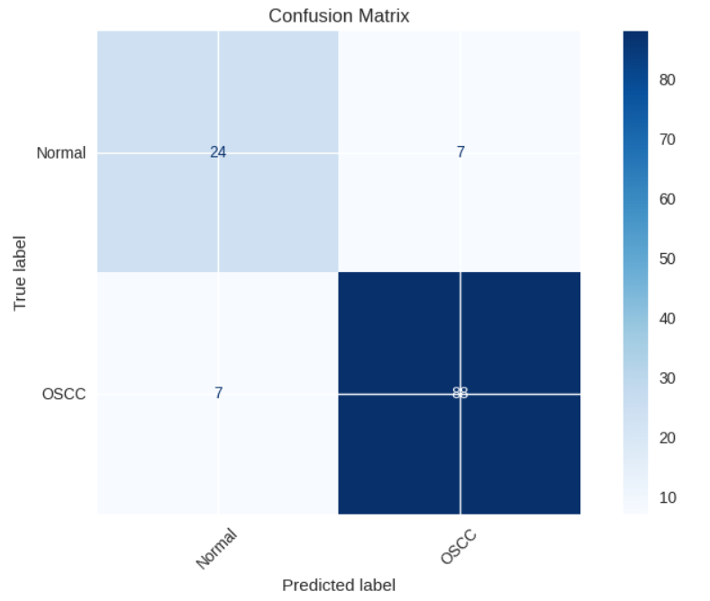
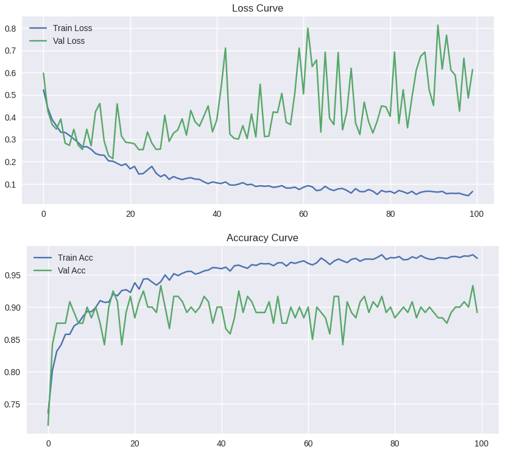
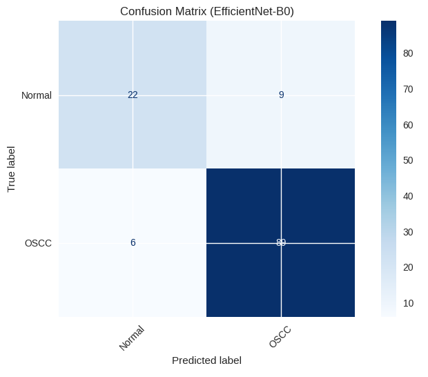
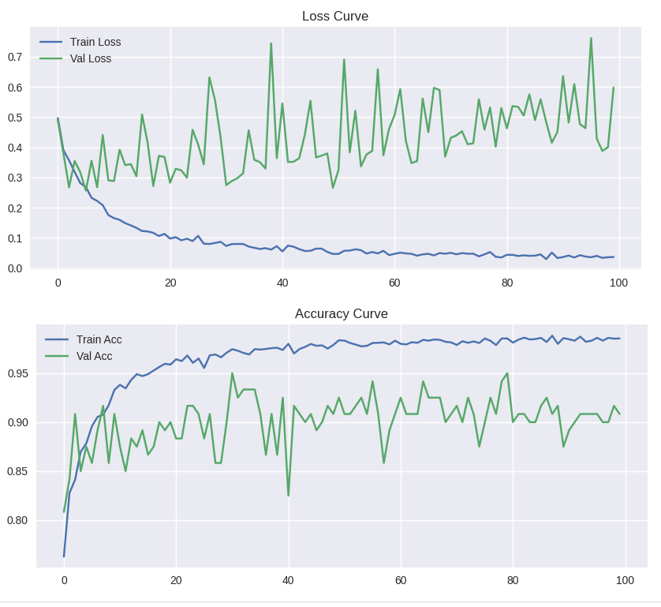
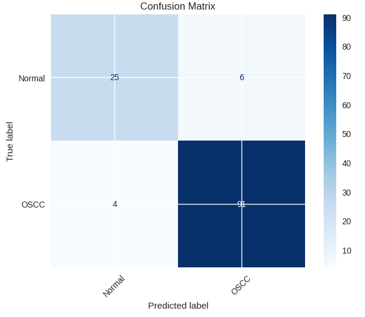
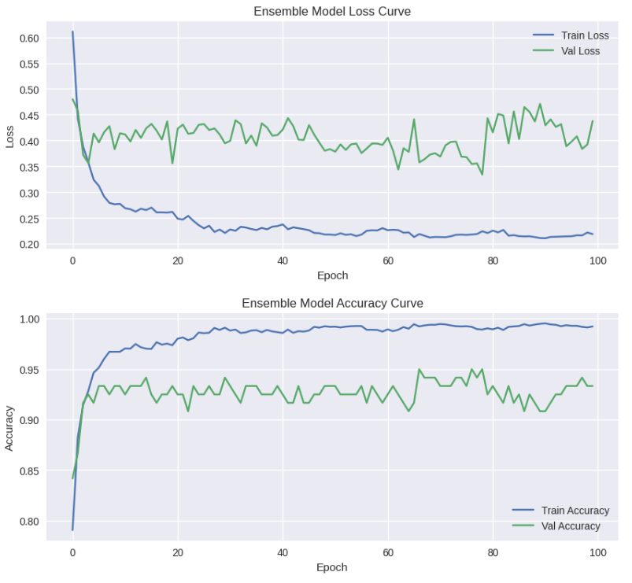
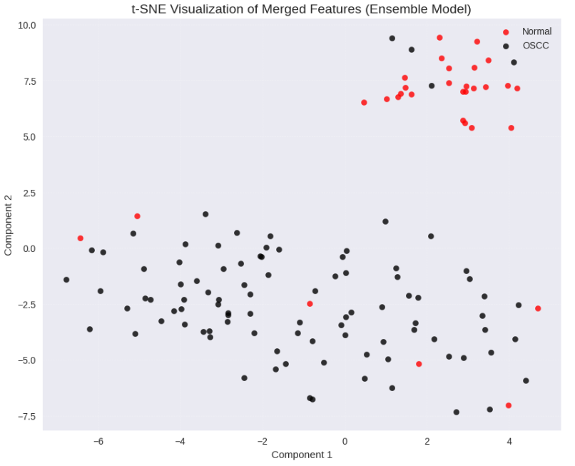

#  Convolutional Neural Networks - Oral Squamous Cell Carcinoma (OSCC) Classification The objective of this project is to carry out **supervised image classification** on histopathological images for detecting **Oral Squamous Cell Carcinoma (OSCC)**. It employs **lightweight and scalable convolutional neural network architectures along with attention mechanisms (CBAM)** and applies data augmentation and preprocessing techniques to classify images into **Normal and OSCC categories**. --- ##  Data Set (OSCC Histopathological Images) The dataset used in this project consists of **histopathological images of oral tissues**, collected from multiple sources and research datasets. It is widely used for developing deep learning models for **oral cancer detection**. The dataset has the following features: * Images are in **JPG format** * Captured using **microscopy (H&E stained slides)** * Includes images from **multiple magnifications (100x and 400x)** * Binary classification problem: * **Normal** * **OSCC (Cancerous)** Dataset organization: * Training set * Validation set * Testing set The dataset is suitable for **binary medical image classification tasks**. --- ##  Image Classification Details The project is implemented in several steps simulating the essential data processing and deep learning pipeline. We implemented the classification in **PyTorch** using multiple architectures inside the notebooks folder. Each step is represented in a specific section inside the corresponding notebook. --- #  OSCC Classification: MobileNetV2 **Corresponding notebook:** `mobilenetv2-oral-squamous-dataset.ipynb` ### STEP 1 - Initialization Importing necessary libraries (PyTorch, NumPy, etc.) and setting random seeds for reproducibility. ### STEP 2 - Loading Dataset Loading the dataset using `ImageFolder` and preparing DataLoaders for training, validation, and testing. ### STEP 3 - Image Preprocessing Data transformations and augmentation using `transforms.Compose`, including: * Resizing images * Normalization * Random horizontal flipping * Random rotations ### STEP 4 - Building CNN Model The model is based on **MobileNetV2 architecture**, consisting of: * Input layer * Depthwise separable convolutions * Inverted residual blocks * Fully connected classification layer ## STEP 5 - Attention Integration (CBAM) Applying **Convolutional Block Attention Module (CBAM)** to enhance feature representation by focusing on important spatial and channel-wise features. ### STEP 6 - Model Training Model is trained using the following configurations: * Optimizer: Adam * Loss function: CrossEntropyLoss * Batch size: Defined in experiments * Epochs: Defined during experimentation ### STEP 7 - Performance Analysis Model accuracy and loss are plotted and analyzed across epochs.   --- #  OSCC Classification: EfficientNet **Corresponding notebook:** `efficientnet-oral-squamous-dataset.ipynb` ### STEP 1 - Initialization Import required libraries and set seeds. ### STEP 2 - Loading and Transforming Dataset Loading dataset using DataLoader and applying transformations: * Resizing * Normalization * Data augmentation ### STEP 3 - Building CNN Model Using **EfficientNet architecture**, consisting of: * Compound scaling (depth, width, resolution) * MBConv blocks * Squeeze-and-Excitation (SE) modules * Fully connected output layer ### STEP 4 - Model Training Model is trained using: * Optimizer: Adam * Loss function: CrossEntropyLoss ## STEP 5 - Attention Integration (CBAM) Applying **Convolutional Block Attention Module (CBAM)** to enhance feature representation by focusing on important spatial and channel-wise features. ### STEP 6 - Performance Analysis Training and validation accuracy are plotted and analyzed.   --- #  OSCC Classification: Hybrid Model (MobileNetV2 + EfficientNet) **Corresponding notebook:** `mobilenet-efficientnet-oral-squamous-dataset.ipynb` ### STEP 1 - Initialization Import necessary libraries and set reproducibility seeds. ### STEP 2 - Feature Extraction Extract deep features from: * MobileNetV2 * EfficientNet ### STEP 3 - Feature-Level Concatenation Combine features from both models to create a more robust feature representation. ### STEP 4 - Classification Layer Pass concatenated features through fully connected layers for final prediction. ### STEP 5 - Model Training Model is trained using: * Optimizer: Adam * Loss function: CrossEntropyLoss ## STEP 6 - Attention Integration (CBAM) Applying **Convolutional Block Attention Module (CBAM)** to enhance feature representation by focusing on important spatial and channel-wise features. ### STEP 7 - Performance Analysis Compare accuracy and loss across models.   --- ##  Performance Analysis Model performance is evaluated using: * Training Accuracy * Validation Accuracy * Loss Curves Training and validation accuracy across epochs (PyTorch): **OSCC Classification Results** | Model                      | Type         | Train ACC | Train F1 | Test ACC | Test F1 | Valid ACC | Valid F1 | Attention    | Notes            | | -------------------------- | ------------ | --------- | -------- | -------- | ------- | --------- | -------- | ------------ | ---------------- | | MobileNetV2                | Single Model | 0.9812    | 0.9812   | 0.8889   | 0.8503  | 0.9167    | 0.8835   | No           | Baseline         | | MobileNetV2                | Single Model | 0.9832    | 0.9832   | 0.8968   | 0.8624  | 0.9417    | 0.9174   | Yes          | Improved         | | EfficientNet               | Single Model | 0.9863    | 0.9862   | 0.8810   | 0.8340  | 0.9250    | 0.8910   | No           | Baseline         | | EfficientNet               | Single Model | 0.9883    | 0.9883   | 0.9048   | 0.8687  | 0.9083    | 0.8688   | Yes          | Improved         | | MobileNetV2 + EfficientNet | Ensemble     | 0.9953    | 0.9953   | 0.9206   | 0.8906  | 0.9083    | 0.8668   | Yes (Fusion) | Best performance | --- ##  t-SNE Visualization t-SNE (t-Distributed Stochastic Neighbor Embedding) is used to visualize high-dimensional feature representations in 2D space. * Helps in understanding **feature separability between Normal and OSCC classes** * Provides insight into model learning capability t-SNE scatter plots are generated for: * MobileNetV2 * EfficientNet * Hybrid Model These plots demonstrate how effectively the models learn discriminative features for oral cancer detection.  ---
